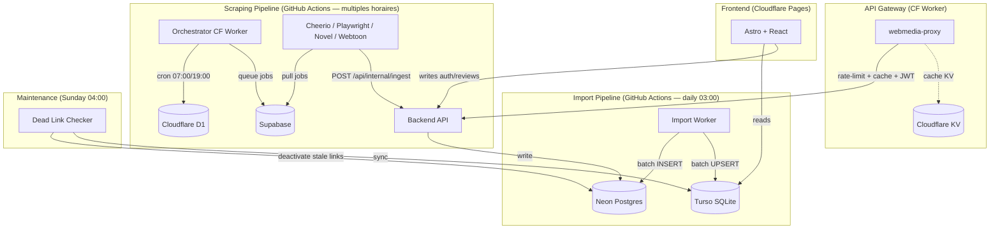

# Architecture — WebMedia

Architecture multi-cloud, coût 0€/mois, utilisant les limites gratuites des hébergeurs.

## Stack

| Service | Plateforme | Rôle |
| :--- | :--- | :--- |
| **Backend API** | Render / Cloudflare Workers | API REST (Hono), auth JWT, ingestion, search |
| **Frontend** | Cloudflare Pages | Astro 6 + React 19 + Tailwind 4 |
| **Source of Truth** | Neon (Postgres) | Catalogue médias, métadonnées, liens |
| **Edge Read Replica** | Turso (SQLite) | Cache de lecture frontend |
| **Queue & Auth** | Supabase (Postgres) | File scraping jobs, users, reviews, favorites |
| **Cache L1** | Cloudflare KV | Cache metadata (trending 1h, search 10min, media 6h) |
| **Rate Limiting** | Upstash Redis | 100 req/min (auth/search), 200 req/min (general) |
| **Orchestrateur** | Cloudflare Worker (cron) | `resolveStaleMedia()` — 07:00 / 19:00 UTC |
| **Import Worker** | GitHub Actions | Import metadata via 12 APIs externes |
| **Scrapers** | GitHub Actions | Extraction liens (Cheerio, Playwright, Custom) |
| **Webtoon Engine** | GitHub Actions | 188+ définitions, 3 langues (en/fr/all) |
| **Recommender** | Render (Python) | FastAPI, TF-IDF cosine similarity |

## Media Types

`film | serie | anime | manga | comic | book | novel | jeu`

## Flux Données



## Cron Jobs

| Plateforme | Horaire UTC | Action | Détail |
|------------|-------------|--------|--------|
| GitHub Actions | **03:00** quotidien | `import-metadata` | 12 sources : TMDB, AniList, IGDB, Google Books, Gutenberg, OpenLibrary, Comic Vine, NosLivres, RoyalRoad |
| GitHub Actions | **08:00 / 20:00** | `cheerio-scraper` | Scrape liens vidéo |
| GitHub Actions | **08:00 / 20:00** | `playwright-scraper` | Scrape jeux (7 sites) |
| GitHub Actions | **08:00 / 20:00** | `novel-scraper` | Scrape romans/novels |
| GitHub Actions | **08:00 / 20:00** | `webtoon-scraper` | Scrape 188+ définitions webtoon |
| GitHub Actions | **06:00** quotidien | `keiyoushi-monitor` | Surveille màj upstream des définitions |
| GitHub Actions | **Dimanche 04:00** | `maintenance-jobs` | Dead link checker → sync Neon→Turso |
| Cloudflare Worker | **07:00 / 19:00** | `orchestrator` | Résout les médias périmés (media_state D1) |

## Import Worker — Détail par Source

| Source | Type | Limite/run |
|--------|------|-----------|
| TMDB | film, serie | 20 (via `IMPORT_LIMIT`) |
| AniList | anime | 20 |
| IGDB | jeu | 20 |
| Google Books | book | **5 par catégorie** (5 catégories, max 25 total) |
| Gutenberg | book | 20 |
| OpenLibrary | book | 20 |
| Comic Vine | comic | 20 |
| NosLivres | book | 20 |
| RoyalRoad | novel | 20 |

Optimisations : batchCheckExisting (1 SELECT IN()), offset tracking persistant, retry 3x backoff exponentiel, ON CONFLICT DO NOTHING.

## Bases de Données

```
Neon (Postgres) ── Source of Truth ── medias, episodes, liens, import_offsets
  │
  └── Turso (SQLite) ── Replica Edge ── mêmes tables (lecture seule frontend)

Supabase (Postgres) ── users, reviews, favorites, scraping_jobs, keiyoushi_state

Cloudflare D1 ── media_state, id_mapping, scrape_queue, genres, plateformes, pays, sources
```

Sync Neon→Turso exécuté après chaque import worker et après le dead link checker.

## API Gateway (webmedia-proxy)

Cloudflare Worker qui wrap le backend Render :

1. **Rate limiting** (Upstash Redis, 100 req/min sur auth/search)
2. **JWT verification** sur routes protégées (/api/user, /api/reviews)
3. **Cache Edge** (KV) : trending→1h, search→10min, media→6h, static→24h
4. **Proxy** toutes les requêtes vers le backend

## Backend API (Hono)

Routes :

| Méthode | Path | Auth |
|---------|------|------|
| GET | `/api/media/trending` | Public |
| GET | `/api/media` | Public (query: type, limit, offset) |
| GET | `/api/media/:type/:slug` | Public |
| POST | `/api/media` | Internal API Key |
| GET | `/api/search` | Public (query: q, type, year) |
| GET | `/api/reviews/:mediaId` | Public |
| POST | `/api/reviews/:mediaId` | JWT |
| GET | `/api/auth/*` | Public |
| POST | `/api/auth/*` | Public |
| GET/POST | `/api/internal/*` | Internal API Key |
| GET | `/api/webtoon/*` | Public (Node.js only) |

## Webtoon Engine

- **188+ définitions** : 106 EN, 42 multi-lang, 11 FR (et extras)
- **Engines** : Madara, MangaThemesia, Keyoapp, MangaHub, MangaCatalog, Iken
- **Pipeline** : `worker.ts` → `runner.ts` → `pipeline.ts`
- Définitions auto-générées depuis le repo keiyoushi upstream

## Recommender (Python)

- FastAPI, TF-IDF cosine similarity via scikit-learn
- Recommandations basées sur le titre, synopsis, genre
- Interroge l'API backend pour les données

## Résilience

- Retry 3x backoff exponentiel (1s, 2s, 4s) sur APIs externes
- Offset tracking persistant (import_offsets dans Neon)
- Batch dedup : `ON CONFLICT DO NOTHING` + `batchCheckExisting`
- Compensation rollback : si D1 fail après Neon, DELETE des lignes insérées
- Fallback mock data frontend si API indisponible
- Cache KV + Turso = lecture même si backend down
