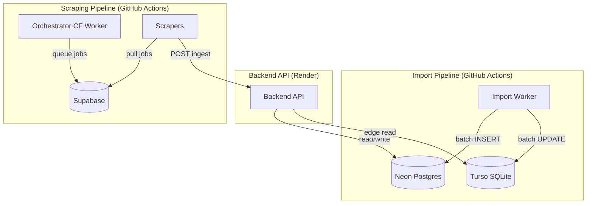

# Strategic Multi-Cloud Architecture (WebMedia)

Architecture distribuée, coût **0€/mois**, utilisant les limites gratuites des meilleurs hébergeurs.

## Composants

| Service | Plateforme | Rôle |
| :--- | :--- | :--- |
| **Backend API** | Render/Node.js | API REST (Hono), ingestion, auth, search |
| **Source of Truth** | Neon (Postgres) | Catalogue médias, métadonnées |
| **Edge Read Replica** | Turso (SQLite) | Cache de lecture edge |
| **Queue & Auth** | Supabase (Postgres) | File d'attente jobs scraping, auth users |
| **Orchestrateur** | Cloudflare Worker | Cron, préparation file scraping |
| **Import Worker** | GitHub Actions | Import metadata via APIs externes |
| **Scrapers** | GitHub Actions | Extraction contenu (Cheerio/Playwright) |
| **Cache L1** | Workers KV | Cache metadata, sub-ms responses |

## Flux de Données



## Import Worker (Metadata)

Exécuté quotidiennement via GitHub Actions, importe les métadonnées depuis des APIs externes :

| Source | Type produit | API |
| :--- | :--- | :--- |
| **TMDB** | film, serie | REST |
| **AniList** | anime | GraphQL |
| **Comic Vine** | comic | REST |
| **Google Books** | book | REST |
| **Gutenberg** | book | RapidAPI |
| **OpenLibrary** | book | REST |
| **NosLivres** | book | REST |
| **IGDB** | jeu | REST + OAuth |
| **RoyalRoad** | novel | REST |

Optimisations :
- **Batch queries** : `batchCheckExisting` (1 SELECT IN() au lieu de N SELECT LIMIT 1)
- **Offset tracking** : progression dans le catalogue via cache GH Actions + table Neon (`import_offsets`)
- **Retry logic** : 3 tentatives avec backoff exponentiel (1s, 2s, 4s) sur erreurs 5xx/réseau
- **CLOUD par source** : `LIMIT` centralisé (défaut 20 par run)

## Pipeline Scraping

1. **Orchestrateur (CF Worker)** → interroge `media_state` (D1) pour contenu périmé
2. **Queue jobs** → pousse dans Supabase
3. **Scrapers (GitHub Actions)** → tirent les jobs, scrappent (Cheerio/Playwright)
4. **Ingestion** → `POST /api/internal/ingest/media` vers le Backend
5. **Finalisation** → Backend met à jour Neon + pousse state vers D1

## Stratégie Base de Données

```
Neon (Postgres) ── Source of Truth ── écritures
  │
  └── Turso (SQLite) ── Replica Edge ── lectures frontend

Supabase (Postgres) ── Queue + Auth ── indépendant
```

Le sync Neon → Turso est exécuté à chaque run de l'import worker.

## Résilience

- **Retry 3x** sur tous les appels API externes (backoff 1s, 2s, 4s)
- **Offset tracking** persistant (cache fichier + table Neon)
- **Batch dedup** : `ON CONFLICT DO NOTHING` + `batchCheckExisting`
- **Erreurs réseau** : ignorées silencieusement, pas de blocage
