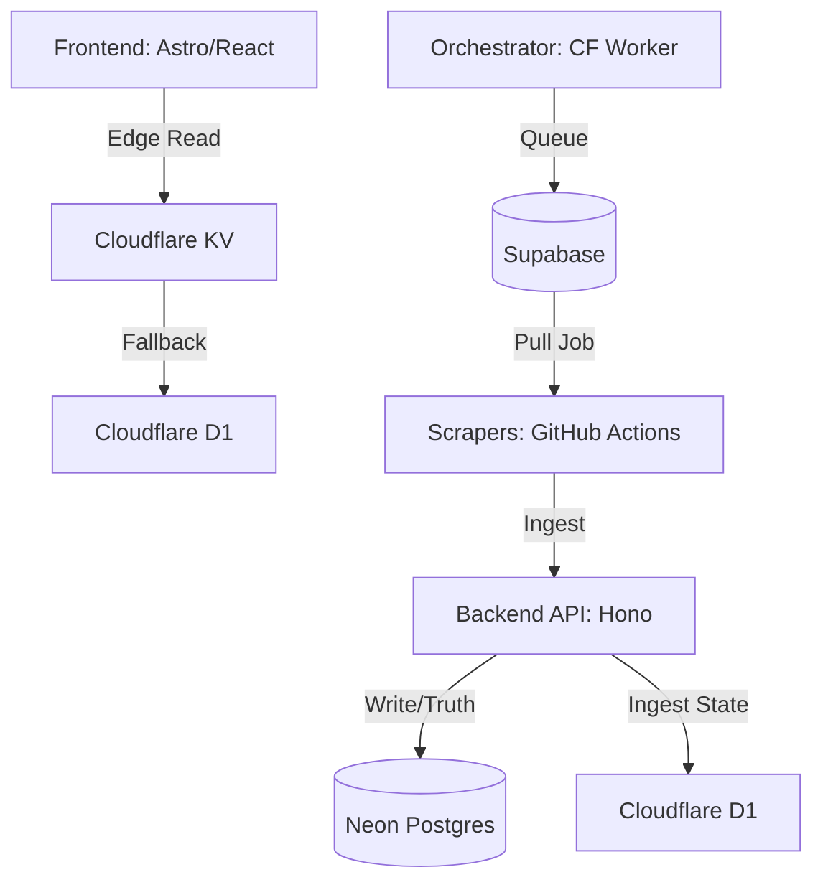

<div align="center">

<br/>

```
██╗    ██╗███████╗██████╗ ███╗   ███╗███████╗██████╗ ██╗  █████╗ 
██║    ██║██╔════╝██╔══██╗████╗ ████║██╔════╝██╔══██╗██║ ██╔══██╗
██║ █╗ ██║█████╗  ██████╔╝██╔████╔██║█████╗  ██║  ██║██║ ███████║
██║███╗██║██╔══╝  ██╔══██╗██║╚██╔╝██║██╔══╝  ██║  ██║██║ ██╔══██║
╚███╔███╔╝███████╗██████╔╝██║ ╚═╝ ██║███████╗██████╔╝██║ ██║  ██║
 ╚══╝╚══╝ ╚══════╝╚═════╝ ╚═╝     ╚═╝╚══════╝╚═════╝ ╚═╝ ╚═╝╚═╝╚═╝
```

**WebMedia — Distributed Media Archiver & Recommendation Engine**

<br/>


<br/>

</div>

---

> **WebMedia is a high-efficiency media recommendation and archival platform.**
> Built with a hybrid-cloud, event-driven architecture, it leverages edge computing and distributed scraping to manage large media catalogs at near-zero infrastructure cost.

---

## 🏗️ Architecture Overview

WebMedia is designed as a decoupled, asynchronous micro-service stack. By separating data concerns (Storage vs. Edge Cache vs. Task Queue), the system achieves extreme resilience and cost-efficiency.



### Component Reference

| Component | Technology | Responsibility |
| :--- | :--- | :--- |
| **Source of Truth** | Neon (Postgres) | Persistent storage for media, metadata, and user data. |
| **Edge Brain** | Cloudflare D1 | Orchestration state, scheduling, media state tracking. |
| **Queue & Auth** | Supabase | Asynchronous job queue management and user authentication. |
| **Cache (L1)** | Workers KV | Global cache for media metadata to minimize DB queries. |
| **Orchestrator** | CF Worker (Cron) | Intelligent cycle triggering with KV-backoff and batching. |
| **Scrapers** | GitHub Actions | Distributed extraction (Cheerio/Playwright) on free compute. |
| **Connection Pool** | Hyperdrive | Low-latency connection pooling to Neon. |

---

## ⚙️ Optimization Strategy

To maintain sustainability, WebMedia utilizes a "Batch-and-Buffer" strategy to minimize request overhead.

### 1. Request Minimization
*   **Batching Ingestion**: Scrapers buffer link findings and submit them to the Backend API in singular batch `POST` requests rather than per-item calls.
*   **Orchestration Batching**: The Orchestrator processes media in batches (50+ items) to reduce D1 query count.

### 2. Intelligent Caching (Workers KV)
*   **Stateful Orchestration**: The Orchestrator queries `Workers KV` before proceeding. If a cycle was completed within the last 30 minutes, it exits early, eliminating redundant DB load and costs.
*   **Edge Caching**: Frontend metadata is cached in KV, providing sub-millisecond responses and shielding D1/Neon from repetitive read traffic.

### 3. Smart Scheduling
The platform follows a synchronized lifecycle to ensure freshness while keeping the CI/CD and Cloudflare costs at zero:

| Job | Cadence (UTC) | Purpose |
| :--- | :--- | :--- |
| **Maintenance** | Sunday 04:00 | System health, log cleanup. |
| **Metadata Import** | Daily 03:00 | Sync with external providers (TMDB, AniList). |
| **Orchestration** | 07:00 & 19:00 | Prepares scraping queue. |
| **Scraping** | 08:00 & 20:00 | Executes extraction of media sources. |

---

## Technical Flow

### The Pipeline Lifecycle
1. **Queueing**: The Orchestrator runs (Twice daily), queries `media_state` (D1) for stale content, and queues new tasks in Supabase.
2. **Execution**: GitHub Actions Workers (Cheerio/Playwright) trigger, pull pending jobs from Supabase, and scrape.
3. **Ingestion**: Results are batched and sent via `POST /api/internal/ingest/media` to the Backend API.
4. **Finalization**: The Backend updates Neon Postgres, closes connections using `Hyperdrive`, and pushes state updates to D1.

---

## Deployment & Setup

### Requirements
- Node.js 20+
- Cloudflare Wrangler CLI
- Database credentials (Supabase/Neon/D1)

### Development

```bash
# Clone the repository
git clone https://github.com/KOUSSEMON-Aurel/Project-WebMedia.git

# Install dependencies (backend)
cd backend && npm install

# Run local development environment with emulated bindings
npx wrangler dev
```

---

<div align="center">

**WebMedia — Distributed Media Engine**

*Scale. Automate. Persist.*

</div>
