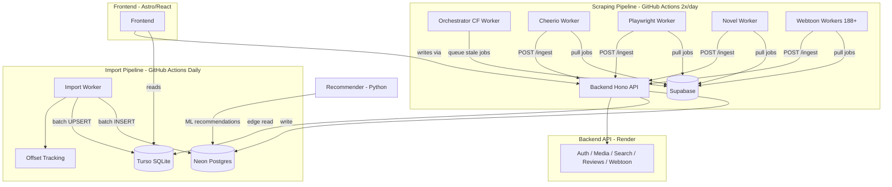

<div align="center">

<br/>
```
██╗    ██╗███████╗██████╗ ███╗   ███╗███████╗██████╗ ██╗  █████╗ 
██║    ██║██╔════╝██╔══██╗████╗ ████║██╔════╝██╔══██╗██║ ██╔══██╗
██║ █╗ ██║█████╗  ██████╔╝██╔████╔██║█████╗  ██║  ██║██║ ███████║
██║███╗██║██╔══╝  ██╔══██╗██║╚██╔╝██║██╔══╝  ██║  ██║██║ ██╔══██║
╚███╔███╔╝███████╗██████╔╝██║ ╚═╝ ██║███████╗██████╔╝██║ ██║  ██║
 ╚══╝╚══╝ ╚══════╝╚═════╝ ╚═╝     ╚═╝╚══════╝╚═════╝ ╚═╝ ╚═╝╚═╝╚═╝
```

**WebMedia — Distributed Media Archiver & Recommendation Engine**

<br/>


<br/>

</div>

---

> **WebMedia** is a distributed media recommendation and archival platform. It scrapes metadata from 12+ external APIs (TMDB, AniList, IGDB, Google Books, Gutenberg, OpenLibrary, MangaDex, Comic Vine, etc.) and 188+ webtoon sources across 3 languages. Data flows into Neon Postgres (source of truth) with a Turso SQLite edge replica for low-latency reads.

---

## Architecture



## Components

| Component | Technology | Role |
| :--- | :--- | :--- |
| **Backend API** | Hono (TypeScript) | API REST — ingestion, auth, search, media CRUD |
| **Source of Truth** | Neon (Postgres) | Catalogue médias, métadonnées, utilisateurs |
| **Edge Replica** | Turso (SQLite) | Read replica edge — lectures frontend |
| **Queue & Auth** | Supabase (Postgres) | File scraping jobs + auth utilisateurs |
| **Orchestrateur** | Cloudflare Worker | Cron 2x/jour, préparation file |
| **Import Worker** | GitHub Actions | Import metadata externe (12 sources) |
| **Scrapers** | GitHub Actions | Cheerio, Playwright, Novel, 188+ webtoon defs |
| **Recommender** | Python (Flask) | ML-based recommendations |

## Type System (8 media types)

```
film | serie | anime | manga | comic | book | novel | jeu
```

Each type has dedicated importer(s), scraper(s), and frontend pages.

## Import Worker

Exécuté quotidiennement (GitHub Actions `import-metadata.yml`). Importe via APIs externes :

| Source | Types | Rate Limit / Volume |
| :--- | :--- | :--- |
| **TMDB** (movie, series) | film, serie | ~40/day (free tier) |
| **AniList** (anime) | anime | ∞ (no auth) |
| **Comic Vine** (comics) | comic | 200/day |
| **Google Books** | book | ∞ |
| **Gutenberg** (Project Gutenberg) | book | RapidAPI |
| **OpenLibrary** | book | ∞ |
| **NosLivres** (French books) | book | ∞ |
| **IGDB** (games) | jeu | 4 req/s OAuth |
| **RoyalRoad** (web novels) | novel | 200/min |
| **MangaDex** (manga) | manga | ∞ |
| **Fribb** (fan fiction) | book | ∞ |

### Optimisations

- **Batch dedup** : `batchCheckExisting` → 1 `SELECT IN()` au lieu de N requêtes
- **Offset tracking** : progression persistée dans `import_offsets` (Neon + cache GH Actions)
- **CLOUD** : `LIMIT` par source (défaut 20/run), évite dépassement taux
- **Retry 3x** : backoff exponentiel 1s, 2s, 4s sur erreurs 5xx/réseau

## Webtoon Scrapers

188+ définitions de scrapers organisées par langue :

| Locale | Count | Examples |
| :--- | :--- | :--- |
| **en/** | 110 | Mangadex, AsuraScans, MangaBuddy, VizShonenJump, Webtoons |
| **fr/** | 16 | ScantradUnion, PhenixScans, PoseidonScans, AnimesSama |
| **all/** | 62 | e-hentai (multi-lang), Komga, XKCD, Cubari |

**Engines** : `Madara`, `MangaThemesia`, `MangaHub`, `MangaCatalog`, `KeyoApp`, `Iken` — templates de scraping paramétrables.

## Frontend (Astro + React)

Pages par type : `animes.astro`, `films.astro`, `books.astro`, `novels.astro`, `games.astro`, `webtoons.astro`, `series.astro`, plus `discover.astro`, `trending.astro`, `search.astro`, `favorites.astro`, `watchlist.astro`.

## Recommender (Python)

Flask app avec embeddings ML. Analyse le catalogue Neon pour recommandations personnalisées.

## Scheduling

| Job | Cadence (UTC) | Action |
| :--- | :--- | :--- |
| **Metadata Import** | Daily 03:00 | Import worker (12 sources) |
| **Orchestration** | 07:00 & 19:00 | Queue stale media for scraping |
| **Cheerio/Playwright/Novel** | 08:00 & 20:00 | Execute scraping jobs |
| **Webtoon Scrapers** | 08:00 & 20:00 | Execute webtoon scraping |
| **Maintenance** | Sunday 04:00 | Health checks, cleanup |

## Development

```bash
git clone https://github.com/KOUSSEMON-Aurel/Project-WebMedia.git

# Backend
cd backend && npm install
npx wrangler dev

# Frontend
cd frontend && npm install
npm run dev

# Test environment
cd test && docker-compose up
```

---

<div align="center">

**WebMedia — Distributed Media Engine**

*Scale. Automate. Persist.*

</div>
