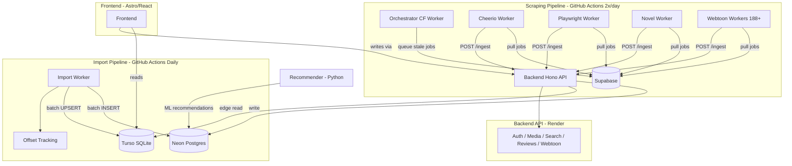

<div align="center">

<br/>
```
██╗    ██╗███████╗██████╗ ███╗   ███╗███████╗██████╗ ██╗  █████╗ 
██║    ██║██╔════╝██╔══██╗████╗ ████║██╔════╝██╔══██╗██║ ██╔══██╗
██║ █╗ ██║█████╗  ██████╔╝██╔████╔██║█████╗  ██║  ██║██║ ███████║
██║███╗██║██╔══╝  ██╔══██╗██║╚██╔╝██║██╔══╝  ██║  ██║██║ ██╔══██║
╚███╔███╔╝███████╗██████╔╝██║ ╚═╝ ██║███████╗██████╔╝██║ ██║  ██║
 ╚══╝╚══╝ ╚══════╝╚═════╝ ╚═╝     ╚═╝╚══════╝╚═════╝ ╚═╝ ╚═╚═╝╚═╝
```

**WebMediia — Distributed Media Archiver & Recommendation Engine**

<br/>


<br/>

</div>

---

> **WebMediia** is a distributed media recommendation and archival platform. It scrapes metadata from 12+ external APIs (TMDB, AniList, IGDB, Google Books, Gutenberg, OpenLibrary, MangaDex, Comic Vine, etc.) and 188+ webtoon sources across 3 languages. Data flows into Neon Postgres (source of truth) with a Turso SQLite edge replica for low-latency reads.

---

## Architecture


```mermaid
graph TD
    subgraph Import[Import Pipeline - GitHub Actions Daily]
        IW[Import Worker] -->|batch INSERT| NEON[(Neon Postgres)]
        IW -->|batch UPSERT| TURSO[(Turso SQLite)]
        IW --> OFFSET[Offset Tracking]
    end

    subgraph Scrape[Scraping Pipeline - GitHub Actions 2x/day]
        ORC[Orchestrator CF Worker] -->|queue stale jobs| SUPABASE[(Supabase)]
        CW[Cheerio Worker] -->|pull jobs| SUPABASE
        PW[Playwright Worker] -->|pull jobs| SUPABASE
        NW[Novel Worker] -->|pull jobs| SUPABASE
        WT[Webtoon Workers 188+] -->|pull jobs| SUPABASE
        CW & PW & NW & WT -->|POST /ingest| BA
    end

    subgraph API[Backend API - Render]
        BA[Backend Hono API] -->|write| NEON
        BA -->|edge read| TURSO
        BA --> Routes[Auth / Media / Search / Reviews / Webtoon]
    end

    subgraph FE[Frontend - Astro/React]
        FB[Frontend] -->|reads| TURSO
        FB -->|writes via| BA
    end

    REC[Recommender - Python] -->|ML recommendations| NEON
```

## Components

| Component | Technology | Role |
| :--- | :--- | :--- |
| **Backend API** | Hono (TypeScript) | API REST — ingestion, auth, search, media CRUD |
| **Source of Truth** | Neon (Postgres) | Catalogue médias, métadonnées, utilisateurs |
| **Edge Replica** | Turso (SQLite) | Read replica edge — lectures frontend |
| **Queue & Auth** | Supabase (Postgres) | File scraping jobs + auth utilisateurs |
| **Orchestrateur** | Cloudflare Worker | Cron 2x/jour, préparation file |
| **Import Worker** | GitHub Actions | Import metadata externe (12 sources) |
| **Scrapers** | GitHub Actions | Cheerio, Playwright, Novel, 188+ webtoon defs |
| **Recommender** | Python (Flask) | ML-based recommendations |

## Type System (8 media types)

```
film | serie | anime | manga | comic | book | novel | jeu
```

Each type has dedicated importer(s), scraper(s), and frontend pages.

## Import Worker

Exécuté quotidiennement (GitHub Actions `import-metadata.yml`). Importe via APIs externes :

| Source | Types | Rate Limit / Volume |
| :--- | :--- | :--- |
| **TMDB** (movie, series) | film, serie | ~40/day (free tier) |
| **AniList** (anime) | anime | ∞ (no auth) |
| **Comic Vine** (comics) | comic | 200/day |
| **Google Books** | book | ∞ |
| **Gutenberg** (Project Gutenberg) | book | RapidAPI |
| **OpenLibrary** | book | ∞ |
| **NosLivres** (French books) | book | ∞ |
| **IGDB** (games) | jeu | 4 req/s OAuth |
| **RoyalRoad** (web novels) | novel | 200/min |
| **MangaDex** (manga) | manga | ∞ |
| **Fribb** (fan fiction) | book | ∞ |

### Optimisations

- **Batch dedup** : `batchCheckExisting` → 1 `SELECT IN()` au lieu de N requêtes
- **Offset tracking** : progression persistée dans `import_offsets` (Neon + cache GH Actions)
- **CLOUD** : `LIMIT` par source (défaut 20/run), évite dépassement taux
- **Retry 3x** : backoff exponentiel 1s, 2s, 4s sur erreurs 5xx/réseau

## Webtoon Scrapers

247 définitions de scrapers organisées par langue (compteur via `listScrapers`) :

| Locale | Count | Examples |
| :--- | :--- | :--- |
| **en/** | — | Mangadex, AsuraScans, MangaBuddy, VizShonenJump, Webtoons, Kodansha |
| **fr/** | — | ScantradUnion, PhenixScans, PoseidonScans, AnimesSama |
| **all/** | — | e-hentai (multi-lang), Komga, XKCD, Cubari |

Répartition exacte : `cd scrapers/webtoons && npx tsx -e "import {listScrapers} from './src/runner'; console.log(listScrapers().length)"`.

**Engines** : `Madara`, `MangaThemesia`, `MangaHub`, `MangaCatalog`, `KeyoApp`, `Iken` — templates de scraping paramétrables.

## Fonctionnement du site — webtoons et comics, de A à Z

Cette section décrit le chemin complet d'une donnée, du site source jusqu'à l'écran.
Elle existe parce que ce chemin est **non évident** et qu'une mauvaise lecture conduit
à des correctifs inutiles. La lire avant de modifier un scraper webtoon.

### Le site est un agrégateur de liens, pas un lecteur

C'est le point le plus important, et le plus souvent mal compris. **Le projet
n'héberge ni ne proxie les images de pages de chapitres.** Il récolte des
métadonnées, les persiste, et renvoie l'utilisateur vers le site source.

### Chemin d'une fiche, étape par étape

| # | Étape | Code | Effet |
| --- | :--- | :--- | :--- |
| 1 | Découverte | `definitions/webtoons/<lang>/<site>.ts` | `getPopular`, `getLatest`, `getSearch` |
| 2 | Détails | idem | `getMangaDetails` : titre, description, tags, couverture |
| 3 | Chapitres | idem | `getChapterList` : la **liste des URL**, pas des images |
| 4 | Pages | idem | `getPageList` → URLs d'images, **jamais utilisées** (voir plus bas) |
| 5 | Import | `scrapers/webtoons/src/pipeline.ts` | insère la fiche en base |
| 6 | Liens | `scrapers/webtoons/src/worker.ts` | `/ingest/liens` : URL du site source |
| 7 | API | `backend/src/routes/media.ts` | `/api/media` renvoie `links` + `episodes` |
| 8 | Affichage | `frontend/src/pages/[type]/[slug].astro` | `LinkFooter.astro` rend des `<a target="_blank">` |

### Ce qui est réellement persistant

Le worker ne traite pas tous les types de médias de la même façon
(`scrapers/webtoons/src/worker.ts`) :

| Type en base | Ce qui est enregistré | Ce qui est visible |
| :--- | :--- | :--- |
| `comic` | une URL de chapitre par entrée dans `liens` | liens de chapitres, groupés par site |
| `webtoon`, `manga` | **une seule URL racine** (`rootUrl`) | la fiche et ses liens |

### Pourquoi `getPageList` n'est pas utilisé

`pipeline.ts` (l. 122-131) appelle bien `getPageList()` sur le premier chapitre
et place le résultat dans `pages`. Le tableau est renvoyé par `scrapeMedia`,
mais **`worker.ts` ne lit jamais `result.pages`** — il ne consomme que
`rootUrl`, `chapters` et `chaptersSaved`. **Le tableau `pages` est donc
calculé à chaque run puis jeté.**

Il existe **aucun lecteur de chapitres webtoon** :

- `frontend/src/pages/[type]/[slug].astro` n'affiche des épisodes que si
  `type` vaut `serie` ou `anime` ; jamais pour un webtoon ou une BD ;
- `backend/src/routes/webtoon.ts` (`/:source/pages`) **n'est pas monté** dans
  `backend/src/index.ts` — c'est un résidu, pas une fonctionnalité ;
- `/api/media` ne renvoie ni chapitres ni pages.

Conséquence : **si une source sert des images de pages obfusquées ou chiffrées,
cela n'a aucun effet ici**, puisque personne ne télécharge ces octets. Il ne
faut donc pas ajouter de décodeur, ni de route image, « pour corriger » un
scraper : il n'y a rien à corriger côté affichage.

### Les couvertures, en revanche, sont bien affichées

Les couvertures voyagent par la table `medias` et s'affichent dans
`CategoryGrid` via `/api/media` :

- `frontend/src/pages/webtoons.astro` appelle `getMediaByType('webtoon')`
  depuis `frontend/src/lib/api` — c'est un appel API, mais **pas** un `fetch`
  direct, d'où la confusion possible en relisant le code ;
- une couverture illisible est donc un vrai bug visible.

### Sources à images obfusquées : le piège de Kodansha

Kodansha (backend Azuki) sert ses images depuis **deux hôtes distincts** :

| Hôte | Contenu | Octets |
| :--- | :--- | :--- |
| `production.image.azuki.co` | **couvertures** | WebP normal (`52 49 46 46` = `RIFF`) |
| `production.image-content.azuki.co` | **pages de chapitre** | obfusqués, `byte ^ 174` |

Vérifié : les octets bruts d'une page commencent par `fce7e8e8…` et donnent
`52494646…` (`RIFF`, WebP valide) après application de `byte ^ 174`.

Le nom des hôtes est la seule chose qui les distingue. Si une source de ce type
est ajoutée **et qu'un lecteur est un jour construit**, le décodeur devra être
appliqué au moment du téléchargement des pages — dans le lecteur, pas dans le
scraper. Le scraper, lui, ne renvoie que des URL.

### Ajouter ou corriger un scraper : la checklist

1. Le nom est résolu par `listScrapers` via `readonly name`, l'argument de
   `super(...)`, ou une affectation `this.name =` — les trois formes sont
   reconnues depuis la restauration de la découverte.
2. `getMangaDetails` doit accepter aussi bien `/series/<slug>` que
   `/reader/series/<slug>`, et une URL de lecteur complète
   (`/episode/<n>`) ne doit pas être lue comme un slug.
3. Un chapitre à numéro non numérique (`4b`, `9b`, `18b`) doit produire
   `chapterNumber: -1`, pas `undefined`, pour rester fidèle au
   `toFloatOrNull() ?: -1f` de la source Kotlin.
4. Ne pas neutraliser `validateStatus` : un 404 sur `getPageList` doit lever,
   sinon il se transforme silencieusement en liste de pages vide.
5. Ne pas ajouter de décodeur d'images : rien dans le projet ne télécharge les
   pages de chapitres (voir plus haut).
6. Vérifier en direct avant de merger, pas seulement `tsc` :
   `npx tsx` avec `getScraper('<nom>')`, puis `getPopular`, `getSearch`,
   `getMangaDetails`, `getChapterList`, `getPageList`.

## Frontend (Astro + React)

Pages par type : `animes.astro`, `films.astro`, `books.astro`, `novels.astro`, `games.astro`, `webtoons.astro`, `series.astro`, plus `discover.astro`, `trending.astro`, `search.astro`, `favorites.astro`, `watchlist.astro`.

## Recommender (Python)

Flask app avec embeddings ML. Analyse le catalogue Neon pour recommandations personnalisées.

## Scheduling

| Job | Cadence (UTC) | Action |
| :--- | :--- | :--- |
| **Metadata Import** | Daily 03:00 | Import worker (12 sources) |
| **Orchestration** | 07:00 & 19:00 | Queue stale media for scraping |
| **Cheerio/Playwright/Novel** | 08:00 & 20:00 | Execute scraping jobs |
| **Webtoon Scrapers** | 08:00 & 20:00 | Execute webtoon scraping |
| **Maintenance** | Sunday 04:00 | Health checks, cleanup |

## Development

```bash
git clone https://github.com/KOUSSEMON-Aurel/Project-WebMediia.git

# Backend
cd backend && npm install
npx wrangler dev

# Frontend
cd frontend && npm install
npm run dev

# Test environment
cd test && docker-compose up
```

---

## TODO

- **Catalogue auto-update** : apres admin CRUD (ecrit dans Turso), declencher export-catalogue.ts vers B2. Build frontend download depuis B2 au lieu de git. Voir ARCHITECTURE.md section 7 pour le pipeline scraping.

---

<div align="center">

**WebMediia — Distributed Media Engine**

*Scale. Automate. Persist.*

</div>
